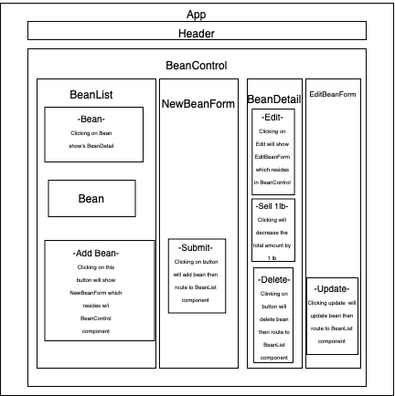

# _Coffee Bean Inventory Tracker using React_

#### By _**Ian Bravo**_

#### _This web application uses React to create a inventory system to track different stocks of coffee beans._

## Technologies Used

* _HTML_
* _CSS_
* _JavaScript_
* _React_
* _npm v8.1.2_
* _node v16.13.1_

## Description

This web application utilizes React to manage and track the user's inventoried coffee beans. This application has full CRUD functionality. After creating an order, the user can click on the the order to view it's details. In this list of coffee bean orders, the user will view the submitted values with no references (i.e. 'Coffee bean name: ' will not be present); the functionality to include these details is a work in progress. This will allow the user to decrement the total amount of the coffee beans by 1 without going below zero. The user will also be able to edit all fields of the original order, including the initial amount, see known bugs. The user will also be able to delete the order.

## Component Diagram

## Setup/Installation Requirements

1. Open Terminal.
2. Change your directory to where you would want the cloned directory.
3. Input the following command into your terminal:  
 `$ git clone https://github.com/ian-bravo/coffee-bean-inventory-tracker`
4. Navigate to the top level of this newly cloned directory.
5. Install all packages with `$ npm install`
6. Build the project using webpack with `$ npm run build`
7. Start a development server with `$ npm run start`
8. Lint JS files in the src folder with `$ npm run lint`

## Known Bugs

* _'Initial amount' input field appears in edit form when it should not._

## License

MIT License  

Copyright (c) 17-Nov-2023 Ian Bravo  

Permission is hereby granted, free of charge, to any person obtaining a copy of this software and associated documentation files (the "Software"), to deal in the Software without restriction, including without limitation the rights to use, copy, modify, merge, publish, distribute, sublicense, and/or sell copies of the Software, and to permit persons to whom the Software is furnished to do so, subject to the following conditions:  

The above copyright notice and this permission notice shall be included in all copies or substantial portions of the Software.  

THE SOFTWARE IS PROVIDED "AS IS", WITHOUT WARRANTY OF ANY KIND, EXPRESS OR IMPLIED, INCLUDING BUT NOT LIMITED TO THE WARRANTIES OF MERCHANTABILITY, FITNESS FOR A PARTICULAR PURPOSE AND NONINFRINGEMENT. IN NO EVENT SHALL THE AUTHORS OR COPYRIGHT HOLDERS BE LIABLE FOR ANY CLAIM, DAMAGES OR OTHER LIABILITY, WHETHER IN AN ACTION OF CONTRACT, TORT OR OTHERWISE, ARISING FROM, OUT OF OR IN CONNECTION WITH THE SOFTWARE OR THE USE OR OTHER DEALINGS IN THE SOFTWARE.

_For questions or concerns, please email me at bravo.ian@gmail.com_